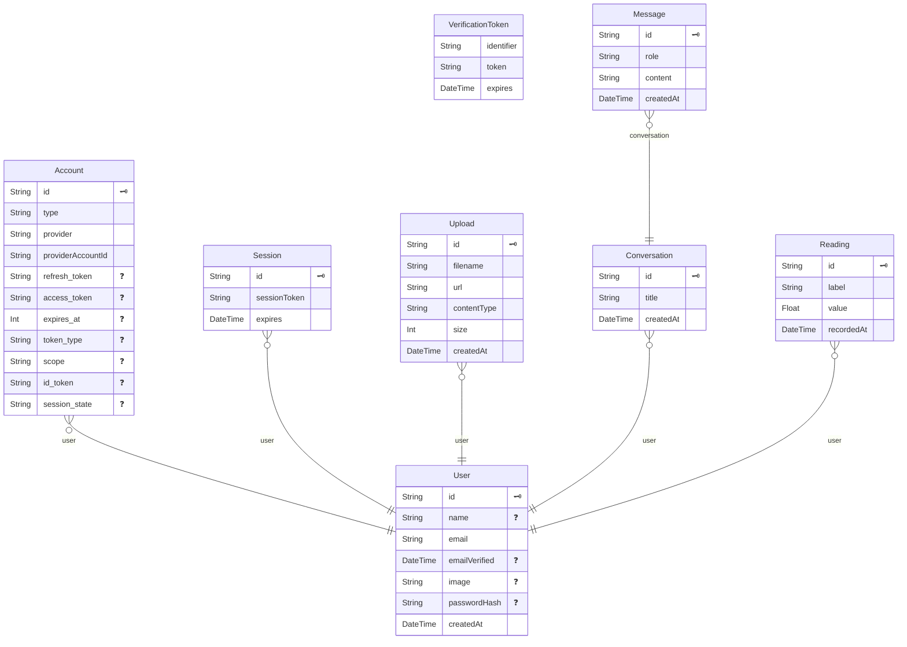

```mermaid
erDiagram

  "User" {
    String id "🗝️"
    String name "❓"
    String email 
    DateTime emailVerified "❓"
    String image "❓"
    String passwordHash "❓"
    DateTime createdAt 
    }
  

  "Account" {
    String id "🗝️"
    String type 
    String provider 
    String providerAccountId 
    String refresh_token "❓"
    String access_token "❓"
    Int expires_at "❓"
    String token_type "❓"
    String scope "❓"
    String id_token "❓"
    String session_state "❓"
    }
  

  "Session" {
    String id "🗝️"
    String sessionToken 
    DateTime expires 
    }
  

  "VerificationToken" {
    String identifier 
    String token 
    DateTime expires 
    }
  

  "Upload" {
    String id "🗝️"
    String filename 
    String url 
    String contentType 
    Int size 
    DateTime createdAt 
    }
  

  "Conversation" {
    String id "🗝️"
    String title 
    DateTime createdAt 
    }
  

  "Message" {
    String id "🗝️"
    String role 
    String content 
    DateTime createdAt 
    }
  

  "Reading" {
    String id "🗝️"
    String label 
    Float value 
    DateTime recordedAt 
    }
  
    "Account" }o--|| "User" : "user"
    "Session" }o--|| "User" : "user"
    "Upload" }o--|| "User" : "user"
    "Conversation" }o--|| "User" : "user"
    "Message" }o--|| "Conversation" : "conversation"
    "Reading" }o--|| "User" : "user"
```
